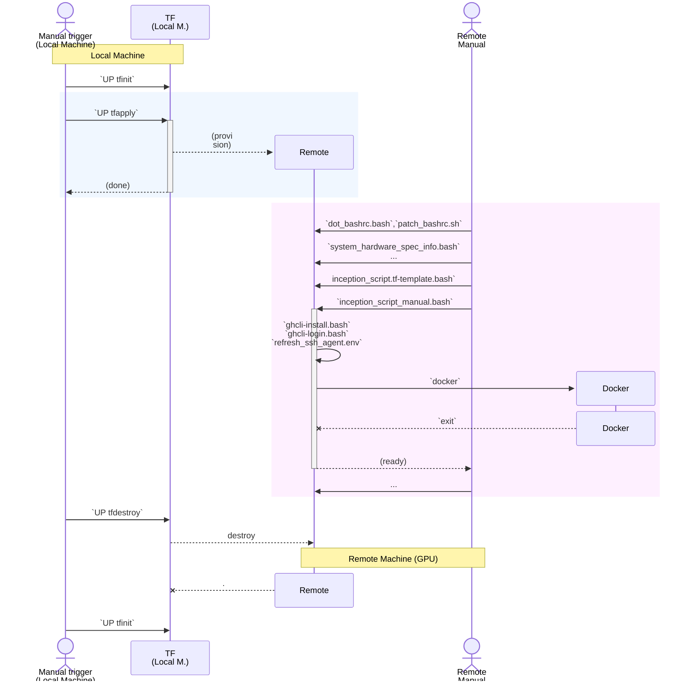

## Steps
(See pocs_for_nikolai: `/README.md` )

Three tf stages: `bash ./terraform/common/localmachine/up.bash  SUBCOMMAND`

, where SUBCOMMAND is:
  `tfinit`
  `tfplan`
  `tfapply`
  `show_outputs`

The `show_outputs` can be in future split into three parts: (and also renamed.).
The Three post-tf scripts: (todo):
1. "show output"
2. go there (idepmpotent)
3. do there (light: `ssh` only)

Then inside there, you need to:
* `bash /home/paperspace/scripts-sosi/scripts_to_push/inception_script_manual.bash`

The mini env (source) scripts: in folder: `/home/paperspace/scripts-sosi/`
*  `refresh_ssh_agent.env`    # super minimal
*  `env_context.bash`         # semi-minimal
*  `scripts_to_push/dot_bashrc.bash`   # ok, but dont make it complicated ( ** I think this is no longer used)

Then! (Currenlty auotmatically done as the last part of `inception_script_manual.bash`)
* git clone
* docker run

## Precedence and Forking Lineage:

see https://github.com/sohale/pocs_for_nikolai/tree/main/terraform

see ....

Key: see
/myvol/pocs_for_nikolai/README.md

see:
provisioning_scripts/terraform/environments/cuda-ptx-hardcoded-dev-experiments/readme.md

e.g.
~/gpu-experimentations/provisioning_scripts/terraform/environments/cuda-ptx-hardcoded-dev-experiments/readme.md

?

../../../environment_boxes/neurotalk/scripts_to_push/inception_script.tf-template.bash

For scripts to run inside the created machine:

https://github.com/sohale/pocs_for_nikolai/blob/main/environment_boxes/neurotalk/local_manual__setup_at_creation.bash
https://github.com/sohale/pocs_for_nikolai/tree/main/environment_boxes/neurotalk/scripts_to_push

