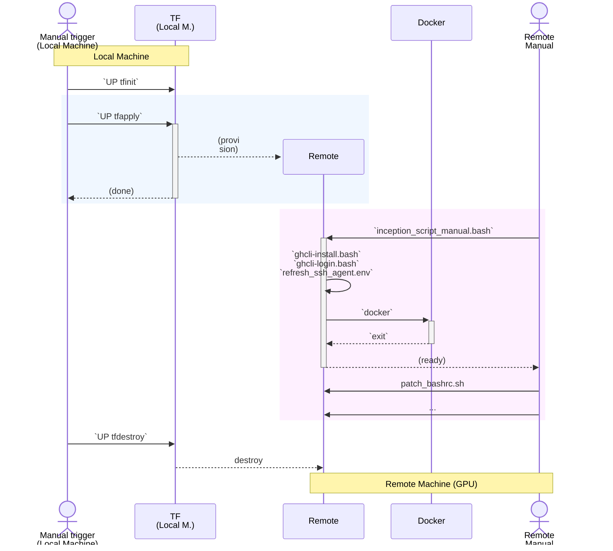

## Precedence and Forking Lineage:

see https://github.com/sohale/pocs_for_nikolai/tree/main/terraform

see ....

Key: see
/myvol/pocs_for_nikolai/README.md

see:
provisioning_scripts/terraform/environments/cuda-ptx-hardcoded-dev-experiments/readme.md

e.g.
~/gpu-experimentations/provisioning_scripts/terraform/environments/cuda-ptx-hardcoded-dev-experiments/readme.md

?

../../../environment_boxes/neurotalk/scripts_to_push/inception_script.tf-template.bash

For scripts to run inside the created machine:

https://github.com/sohale/pocs_for_nikolai/blob/main/environment_boxes/neurotalk/local_manual__setup_at_creation.bash
https://github.com/sohale/pocs_for_nikolai/tree/main/environment_boxes/neurotalk/scripts_to_push

